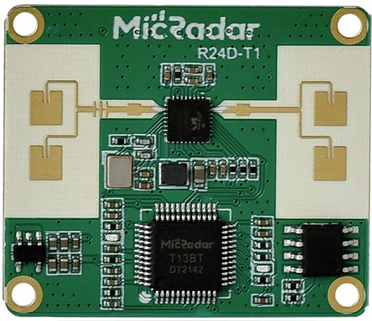

### Disclaimer

Please note that some technical files and documentation related to this project cannot be disclosed due to a Non-Disclosure Agreement (NDA) with the company I worked at. As such, certain design files, schematics, and proprietary information have been excluded from this repository. However, a general overview of the project, including its objectives, components, and contributions, has been provided in this README for public reference.

If you have any questions or would like further information, feel free to contact me directly.

# IoT-enabled Human Presence Sensor Module

This project involves the design, development, and testing of an IoT-enabled Human Presence Sensor Module. The solution uses a commercially available 24GHz mmWave sensor to detect static human presence, offering a more reliable alternative to traditional motion sensors like PIR and Microwave sensors. The project aims to provide an advanced solution for human occupancy detection in various applications, including smart home automation.

  

## Objective

The goal of this project was to develop and test an IoT-enabled Human Presence Sensor Module using a 24GHz mmWave sensor and a microprocessor to interface with the Tuya IoT cloud platform, enabling various parameter inputs for smarter and more customizable sensor control.

## **Key Features**

1. **Sensor Integration**: The 24GHz mmWave sensor was interfaced with an ARM Cortex-M0 microprocessor via UART for data communication. The microprocessor is responsible for collecting sensor data and transmitting it to the Tuya CB3S WiFi chip.
   
2. **IoT Integration**: The Tuya WiFi chip connects the sensor system to the IoT Tuya cloud platform, allowing users to input and adjust sensor parameters remotely via the Tuya app or web interface.

3. **PCB Design**: The custom PCB was designed in KiCAD, incorporating all necessary components such as the sensor, microprocessor, WiFi chip, and power management systems. Optimal component placement and roensured to minimize noise and ensure reliable operatiouting were n.

4. **Enclosure Design**: A custom 3D-printed PLA enclosure was designed to house the entire system, ensuring all components fit securely while providing ventilation and easy access to the user interface. The design was based on the manufacturer's specifications to ensure proper fit and functionality.

5. **Testing**: The test prototype was subjected to various testing scenarios to evaluate its performance, including its ability to detect human presence accurately and its integration with the Tuya cloud system. The system was tested for reliability in both static and dynamic environments.

### Technologies Used

- **24GHz mmWave Sensor**: Detects static human presence with high accuracy.
- **ARM Cortex-M0 Microcontroller**: Controls the sensor and interfaces with the IoT platform.
- **Tuya CB3S WiFi Chip**: Provides wireless connectivity for the IoT solution.
- **UART Communication**: Used to interface the microprocessor with the mmWave sensor and the Tuya WiFi chip.
- **Custom PCB**: Designed using KiCAD
- **Custom Enclosure**: Designed in Fusion 360 and fabricated using FDM 3D Printing to house the setup. 

### Alternate Testing

An alternate non-smart version of the sensor was developed using potentiometers to manually adjust the parameters. This version was also tested to compare the performance and usability with the IoT-enabled version.

## Conclusion

The IoT-enabled Human Presence Sensor Module proved to be highly effective in detecting human occupancy, offering advantages over traditional motion sensors like PIR and Microwave sensors, which are commonly used in smart home systems. The test prototype demonstrated the feasibility of using the mmWave sensor for static human presence detection, making it a viable replacement for existing motion sensors in smart home automation systems. 

The integration with Tuya's cloud platform allows for easy customization and control, making it a flexible solution for various applications. The alternate non-smart solution using potentiometers also showcased a more cost-effective option.

## Future Work

- Enhance the system's ability to detect multiple users simultaneously and count them.
- Implement advanced algorithms for occupancy tracking and data analysis.
- Explore integration with other IoT platforms for broader compatibility.