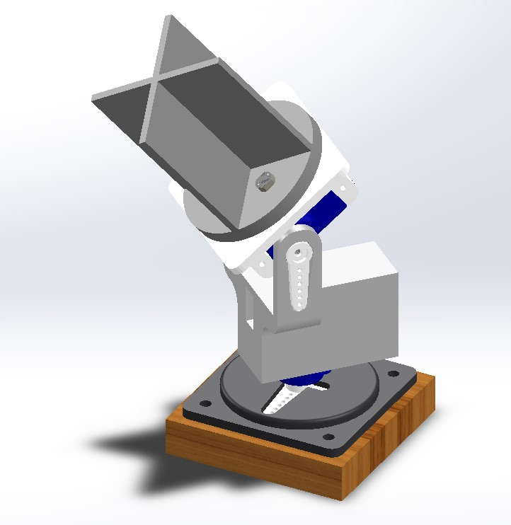

# Automated Solar Tracker for Efficient Energy Harvesting

This project focuses on designing and prototyping a dual-axis solar tracking system to maximize solar energy harvesting. The primary aim of this project was to gain hands-on experience with the ROS (Robot Operating System) framework while solving a real-world problem. By utilizing advanced simulation and control systems, the tracker aligns the solar panel with the Sun's position throughout the day, improving energy efficiency by up to 40%.

---

## **Key Features**

### 1. Dual-Axis Solar Tracking  
- The tracker employs two SG90 servo motors to align the solar panel with the Sun’s position throughout the day.  
- The dual-axis movement enables precise adjustments in both horizontal and vertical planes, minimizing the angle of incidence between sunlight and the panel.  

### 2. Real-Time Light Detection  
- Four strategically placed Light Dependent Resistors (LDRs) continuously measure light intensity.  
- The data from the LDRs is processed to determine the direction of the Sun, ensuring the panel remains aligned with the brightest light source.  

### 3. Automated Control System  
- The Arduino Uno microcontroller processes inputs from the LDRs and controls the servo motors in real time.  
- Custom algorithms ensure smooth and efficient movements to optimize energy harvesting without unnecessary power consumption.  
- [See Automatic Operation in action](Automatic Operation in ROS/automatic_demo.mp4)

### 4. Manual Operation Mode
- A manual control mode allows users to adjust the tracker’s position via ROS commands.  
- This mode is particularly useful for debugging and testing purposes, ensuring seamless operation even in case of automation failures. 
- [See Manual Operation in action](Manual Operation in ROS/manual_demo.mp4) 

### 5. Simulation and Validation  
- The movement of the tracker is simulated in Gazebo using ROS and URDF, allowing for detailed testing before physical implementation.  
- The simulated environment replicates real-world conditions, helping to validate the design and control algorithms.  

### 6. Custom Tracker Module  
- The tracker module is designed in Fusion 360 and fabricated using FDM 3D printing.  
- The compact and robust design ensures durability while maintaining a lightweight structure suitable for outdoor use.  

### 7. Energy Efficiency  
- The system is designed for minimal power consumption, ensuring that the energy used for tracking is outweighed by the energy harvested.  
- The use of lightweight components and optimized algorithms contributes to overall system efficiency.  

### 8. Increased Energy Harvesting  
- Testing demonstrated a 40% increase in energy harvested compared to stationary solar panels.  
- This efficiency gain highlights the system's potential for significantly improving solar energy utilization.  

---

## **Technologies Used**
- **Microcontroller**: Arduino Uno  
- **Sensors**: Light Dependent Resistors (LDRs) for light intensity measurement  
- **Actuators**: SG90 servo motors for dual-axis movement  
- **Design Tools**: Fusion 360 for CAD modeling  
- **Fabrication**: FDM 3D printing for tracker module  
- **Framework**: ROS (Robot Operating System) and URDF for modeling and control  
- **Programming Languages**: C++ for Arduino and ROS integration  

---

## **How It Works**
1. [**Automatic Control**](Automatic Operation in ROS/automaticcntrl_servo_solar/servo_automaticcntrl_solar.ino) 
   - LDR sensors detect the direction of maximum light intensity.  
   - Arduino processes the sensor data to control servo motors, ensuring optimal solar panel alignment.  

2. [**Manual Operation**](Manual Operation in ROS/manualcntrl_servo_solar/servo_manualcntrl.ino)
   - For debugging, the tracker can be manually controlled using ROS commands to adjust the servo angles.  

3. **Simulation**
   - ROS and URDF are used to simulate the solar tracker’s movements, allowing validation of the mechanism before deployment.

---

## **Results**
- The device achieved a 40% increase in solar energy harvesting efficiency compared to stationary panels.
- Both manual and automatic control modes were successfully validated through testing.

---

## **Future Work**
- Integrating IoT for remote monitoring and real-time analytics.
- Exploring larger-scale implementations with more robust materials.